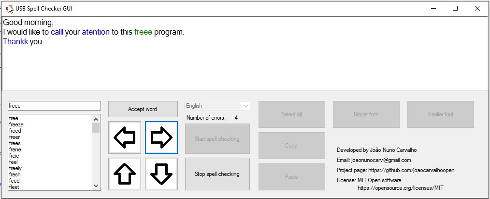
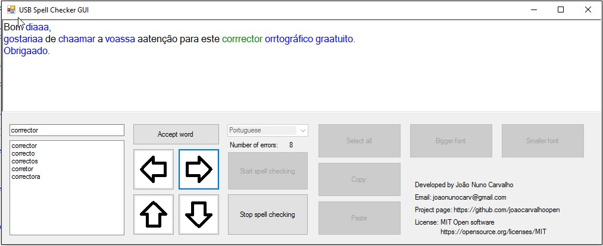

# USB SpellChecker GUI in C Sharp

---
## Description:
This application is a spell checker for the English and Portuguese languages and comes fully integrated with a small editor. It is open source with a MIT license, and can function without installation from a USB pen drive or any directory in a Windows 7 system or greater.

---
## How to install the software
To install the software simply download the file () from GitHub and run it in a directory that you like to self-extract the files of the application. 
It runs directly from the .exe file and doesn’t need any external files other then, the world list files. 

---
## Features
- Spell checker for English and Portuguese Languages
- Integrated editor
- It’s fast
- Works from a USB Pen drive without installation
- Works from any directory, just copy four files
- Works on windows 7 or greater
- MIT open source license
- Developed in C# .net 4.6 and then ported to .net 3.5 to work without installation on windows 7

---
## How does a spell checker works?
This program has 4 parts, a GUI (Graphical User Interface) made with Windows Forms, a string tokenize algorithm for each language, that extract’s the language words of the text string. A spell checker algorithm that supports both languages and has an algorithm for collecting statistics from large text’s and generate word lists with frequency of each word. 
The spell checker is based on the open source spell checker algorithm published by Peter Norvig on the following article [How to Write a Spelling Corrector](http://norvig.com/spell-correct.html). The original algorithm was made in Python and works by having a large text in which the words and its frequency are collected. Then, for each word that we try to correct, if it exists in a hash table it is a correct word. If it doesn’t exist, it will apply changes in what is called an edit distance of one. It makes a one-character insertion, replacement, deletion and transposition. And tries to see if any of those words appear on the hash table of valid words. The one that exist and has a higher frequency is returned. If the edit1 distance doesn’t return a word it repeats the process but for an edit distance of 2 characters. 
In the spell checkers implementation, the generation of edit distances is a common task. 
Please read the Peter Norvig Article for more details. 
Although there were other implementations of Peter Norvig Python algorithm in C#, I decided to make my own, I give my bare bones implementation in the class (PeterNorvigSpellChecker.cs), but then I made a greatly tweaked version of it (TweakedPeterNorvigSpellChecker.cs) and this last one is the one used in the USB Spell Checker GUI.  

The tweaks where the following:
- Added the capability to spell check Portuguese, side by side with English.
- Added the capability of words with ‘ to the English language.
- Added in the Portuguese version the change of ‘ç’ to ‘ss’ and ‘ss’ to ‘ç’.
- Added support for returning a list of words suggestions with a complex sorting order   
- Added support for loading words lists directly in a more compact way (faster).
- Added performance optimizations
 
Link to Peter Norvig article and code, [How to Write a Spelling Corrector](http://norvig.com/spell-correct.html). 

This project also has a trigram generation class, that parse text’s and generates trigrams frequency lists, but it turns out that the trigrams file of a 320 MB text has 400MB. Although it’s a big file, isn’t very complete from a trigram point of view, but that is a huge file to be used in this spell checker, that is supposed to leave in a USB pen drive. It’s was originally minted to be used to give a notion of correct grammar to the spell checker suggestions, changing the sorting criterion of the suggested words. 

To learn more about how spell checkers work, I recommend the reading of the following paper that Peter Norvig also recommends, [Using the Web for Language Independent Spellchecking and Autocorrection](http://static.googleusercontent.com/external_content/untrusted_dlcp/research.google.com/en/us/pubs/archive/36180.pdf),  it a very accessible paper and gives a good perspective of what is leading edge in statistical spell checkers. This are the ones like the USB Spell Checker, in which the rules of grammar and categories of each word in terms of its grammatical type, aren’t manually coded inside the Spell Checker. The developers of one type of spell checker needs a profound understanding of the language of the spell checker, the other type it’s the statistical process that gives that insight, and works the same for all languages, it’s a more generic method. 

---
## Word lists
To create the frequency word lists files, several text sources where used. 
For the English language the European Parliament sessions corpus textual of several years and the United Nations sessions corpus textual were used. 
For the Portuguese language the European Parliament sessions and the word list from Minho University, the Open Source project Natura. 
It was made a small program to generate a word list with every word in the text that is a valid word in the language (English / Portuguese) and to count each occurrence in the text.  
In the Portuguese case the word list of the European Parliament is loaded and then it’s loaded the Project Natura word list. It’s given a weight of 10 counts to Project Natura over the current word frequency count of the European Parliament.  The reason is that Project Natura word list, only contains words and not their occurring frequency, but all words that exists in Project Natura are valid Portuguese words, and the same can’t be said from the words of the European Parliament sessions in Portuguese. 
   
[European Parliament Proceedings Parallel Corpus 1996-2011](http://www.statmt.org/europarl/) 
[United Nations Parallel Corpus](http://conferences.unite.un.org/UNCorpus) 
[Universidade do Minho - Projecto Natura](http://natura.di.uminho.pt/wiki/doku.php) 

---
## Why is the distributed file in a compressed self-extracting .exe?
In order to facilitate the distribution of the project, a compressed version of it is used, in the form of a WinRar rar5 self-extraction executable. This also prevents the erroneous virus alert from Gmail from occurring. If it is in RAR or in ZIP it occurs.  See the “Erroneous virus warning on a small set of Virus Scanners” below.

---
## Execution on Windows 10
When running this application in Windows 10 it shows a message saying, that this application isn’t signed and because of that it could be bad to your computer. The application is a normal application and to run it you have to choose “more info” and “run anyway”. 
In the properties of the .exe file you can choose to ignore this warning that the application isn’t signed.  

---
## Erroneous virus warning on a small set of anti-virus applications (including Gmail).
This application was developed in a computer that is virus free and has a good anti-virus installed, In the case, Kaspersky.  When I tried to send it as an attachment in Gmail, the .exe was marked has a virus, so I went to VirusTotal [www.VirusTotal.com](http://www.VirusTotal.com) and submitted the file be checked by more than 50 anti-virus programs, ranging from the most renowned to the most popular, and only 3 not very known, in I think, 54 marked it as containing a virus. This showed that I had the unfortunately that the Visual Studio C# compiler generated a sequence of bytes that is statistically similar to a virus, but that it isn’t a virus for 3 out of 54 antivirus applications. When I tried to compress the file with the ZIP or a the RAR format it was always marked has a virus, so I compressed in a self-extracting file with RAR5 algorithm.  

